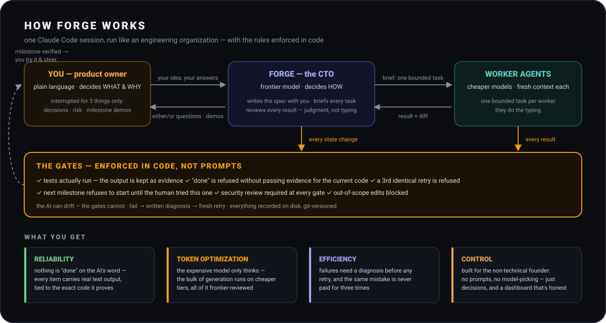

<p align="center">
  <picture>
    <source media="(prefers-color-scheme: dark)" srcset="plugins/forge/icons/logo_white_nobg.png">
    
  </picture>
</p>

# Forge — spec-first engineering orchestration for Claude Code

Forge is a Claude Code plugin that turns one session into an engineering
organization. The main agent (on the strongest available model) operates as
CTO: it interviews you until your idea is a precise spec, converts the plan
into a work graph, briefs cheaper worker agents, **machine-verifies every
result** (it runs the tests and keeps the output — a worker saying "done"
counts for nothing), and stops at each milestone so you can try the running
slice and steer. You own WHAT and WHY; Forge owns HOW. You are interrupted
for exactly three things: a product decision, a high-risk approval, and a
milestone review.

<p align="center">
  
</p>

## Why it exists

Agentic coding fails in predictable ways: work marked complete on the
model's say-so, the same failed fix retried until the budget dies,
"helpful" edits outside the task's scope, documentation drifting from the
code within a week, and two sessions silently overwriting each other. The
usual answer is better prompting. Forge's answer is that **prompts are
advice and advice gets ignored under pressure — so every rule that matters
is enforced in code**: a zero-dependency state CLI that refuses illegal
transitions, and hooks that fence the session. The model supplies judgment;
the gates supply discipline. Everything recoverable lives in plain
git-versioned files, so the conversation is never the memory and any fresh
session resumes exactly where things stood.

## What makes it different

Every claim below is a refusal in code, not an instruction in a prompt —
and every one is covered by a test in `tests/cli.test.js` (`npm test`,
76 tests):

- **DONE requires a passing verification record for the current tree** — no record, a failed record, or evidence older than the latest edit all refuse.
- **Checks must prove something** — `start` records each criterion check's pre-work result; if everything was green before work and nothing changed, `done` refuses (vacuous or already-satisfied criteria get flagged, not laundered).
- **No work item starts without acceptance criteria**, with unmet dependencies, or while already in progress — an in-flight item must be resolved (done / failed-with-diagnosis / blocked) before any re-dispatch, so retries can't dodge the counter.
- **A third identical retry is rejected** — after 2 recorded failures the CLI forces an explicit escalation (stronger model / decompose / revise criteria / do-it-yourself).
- **Milestones end in human review** — with `options.gates` at its `per-milestone` default, items of the next milestone refuse to start until you've tested the finished slice and recorded approval (`forge milestone approve`). Choose `end-only` to run straight through.
- **Security is part of the gate** — `approve` refuses until a security review of the slice is recorded (`forge milestone security <M> --note`), skipped only explicitly (`--skip-security --reason`, logged) or disabled per project (`options.security off`). Deterministic scanning runs continuously: set `verify.security` and it executes inside every `task verify` like any other check.
- **Brownfield changes are baseline-guarded in the verification itself** — once a baseline exists, `task verify` runs the comparison automatically; a regression fails the record (deliberate skips need `--skip-baseline --reason`).
- **State files can only change through the CLI** — direct edits are blocked by a hook; work-item edits go through audited `forge task update`; cancelling an item with live dependents forces an explicit decision about them.
- **Sessions can't end with silently dangling work** — the stop gate catches in-progress items and failed items parked in TODO.
- **One orchestrator per project** — a session lock (heartbeat on every write) makes hooks refuse writes from a second session while the first is active; a clean finish releases it, a stale one ages out, and `forge session takeover --force` clears a dead session's lock.
- **Log entries can't lose their identity** — `decision add` / `discovery add` refuse when no title is given (a bare positional argument counts as the title), instead of silently recording "(untitled)".
- **Scope is enforced, not advisory — in both directions** — while an item is IN_PROGRESS, edits to its `scope.forbidden` paths are blocked by the hook, paths frozen in config (`options.protect`) are blocked always, and when every running item declares its `scope.allowed`, edits *outside* that territory are blocked too. An item can't even start without a declared scope (`--whole-tree --reason` for deliberate exceptions). (Applies to file-tool edits; shell-level writes remain a review concern.)
- **One item in flight is a gate, not a habit** — `task start` refuses a second IN_PROGRESS item at the default `options.concurrency 1`; running items in parallel is a deliberate per-project setting, and parallel items must have disjoint file scopes — overlap is refused.
- **Concurrent state writes can't silently lose an update** — every mutating command serialises through a lockfile; live contention refuses loudly, a dead process's lock breaks automatically and the break is traced.
- **Worker handoffs are records, not archaeology** — `forge task dispatch` stores who was launched (and any mid-flight message to a running worker) in state, per attempt.

Development discipline: **every field failure becomes a permanent test** —
the session lock, the untitled-log refusal, and the dispatch-tie fallbacks
all began as observed failures and stay in the suite as regressions.

Beyond the gates, Forge carries the full lifecycle: a layered spec method
(vision → domain → experience → API → logic → foundation) with mocks-as-spec
for UI work, a brownfield mode that baselines before touching anything and
grows a provenance-tagged spec as work happens, security folded into both
verification and the milestone gate, observed token/dispatch telemetry and
process metrics (never estimated), a zero-token generated dashboard with the
architecture drawn from the repo, `forge upgrade` to keep older plans current, and a flight recorder + `doctor` self-check for when
anything looks off. Start with `docs/manual.html` — the interactive
companion — and `docs/architecture.html` for the diagrams.

## Disclaimer

I built Forge for myself, to run my own projects, encoding my own
methodology and opinions about how AI-driven engineering should be
disciplined. I'm sharing it because it works well for me, not because it's a
product: expect opinionated defaults, a solo-developer perspective, versions
that move fast, and no support guarantees. It has been exercised on real
projects but is young — read the changelog, run `forge doctor`, and judge
for yourself. Issues and ideas are welcome; my own projects come first.

## Install

```
/plugin marketplace add https://github.com/rvmoretti/forge
/plugin install forge@forge-marketplace --scope project
```

Requires Node ≥ 18 (which Claude Code already requires) and git.
Optional enhancers, detected by preflight: [Graphify](https://github.com/Graphify-Labs/graphify) (deterministic code
graph — recommended), Playwright (machine-verified E2E for web projects).

## Use

**Greenfield:** open Claude Code in an empty repo, describe your product.
The `forge-method` skill runs the layered spec interview (vision → domain →
experience → API → logic → foundation). When the spec gates, say "build it".

**Brownfield:** open your repo, ask for the change. The `forge-brownfield`
skill orients (Graphify-first), captures a baseline, asks you only the
product questions the code can't answer, then runs the same loop. Forge
asks which of two doors you're entering through: **a bounded change**
("just start working") or **a destination** — you have a vision of where
the project should be, as a feature/change set and possibly mockups. The
destination mode is the brownfield equivalent of the greenfield spec
interview: your goals supply intent, the code supplies reality, and Forge
plans the gap — spec, mocks, and a milestone cut across everything.

**Commands:** `/forge:status` · `/forge:preflight` · `/forge:build` · `/forge:dashboard` · `/forge:usage` · `/forge:stats`

**Dashboard:** `forge/dashboard.html` — a generated projection of everything on
disk (progress, work graph by milestone, attempts/verifications, decisions,
discoveries, preflight, baseline, spec files). It regenerates automatically on
every state change, zero tokens; open it in a browser and just reload. State
wins — never edit it, never treat it as the source of truth.

You get interrupted for exactly three things: a product decision the spec
doesn't answer, a high-risk approval, and milestone reviews.

## What's inside

```
plugins/forge/
├── core/OPERATING.md      the CTO operating contract (injected every session)
├── bin/forge.js           state CLI — work graph, verification, retry ladder,
│                          baseline, preflight, decisions/discoveries logs
├── hooks/hooks.json       session-start context, state write-guard, stop gate
├── agents/                forge-explorer (haiku) · forge-implementer (sonnet)
│                          forge-tester (sonnet) · forge-reviewer (opus)
│                          forge-architect (opus)
├── skills/
│   ├── forge-method/      the spec-first METHOD (verbatim) + mocks + work-graph handoff
│   ├── forge-brownfield/  orientation, baseline, mini-spec protocol
│   └── forge-domain-packs/ backend · frontend · design-ux · testing · security
│                          checklists (curated from msitarzewski/agency-agents)
├── commands/              /forge:status /forge:preflight /forge:build
│                          /forge:dashboard /forge:usage /forge:stats
└── docs/
    ├── manual.html        the interactive companion — install → daily use →
    │                      every refusal decoded; open in any browser
    ├── manual.md          the same manual as plain markdown, for AI consumption
    ├── architecture.html  functional diagrams — who talks to whom, where the
    │                      truth lives, the work-item state machine with its
    │                      refusal edges
    └── TRACEABILITY.md    FORGE spec §1–§333 → where each rule lives
```

## Per-project state (created by `forge init`)

```
forge/
├── config.json        phase, verify commands, options    (CLI-managed)
├── state/             work.json · preflight · baseline · session.json (lock)
│                      components.json (map) · trace.jsonl (flight recorder)
│                      (CLI-managed, hook-protected)
├── decisions.md       append-only, titled, human/forge authority tagged
├── discoveries.md     append-only, titled, consequence-tracked
└── dashboard.html     generated projection (overview, plan, architecture, screens…) — never edited
```

Everything is plain JSON/markdown, git-versioned, human-inspectable. A fresh
session recovers the full picture from disk — the conversation is never the
memory.

## Changelog

### v0.21.1 — Graphify git hook found under core.hooksPath
- The Configuration page and `forge doctor` said "graph is not rebuilt after commits" in projects
  whose git hooks live in a tracked folder (`core.hooksPath`, e.g. `.githooks/`), although
  `graphify hook install` had installed them there. Forge now asks git where hooks live
  (`git rev-parse --git-path hooks`) instead of assuming `.git/hooks`.

### v0.21.0 — the CTO leads a team again (docs/IMPL-team-delegation.md)
Every behaviour change below sits behind an `options.*` switch: **on for projects created by
v0.21, off when absent** — existing projects change nothing until you turn a switch on, one per
measured segment (`forge doctor` lists each switch and the command to enable it).
- **Usage counts real calls (C0).** Claude Code writes one transcript line per content block,
  each repeating the same message id and usage; Forge counted lines. One measured transcript:
  497 lines for 229 calls. Calls, context and output are now counted once per message id
  (cache v5 rescans by itself; baselines recorded before this are flagged as a different definition).
- **Verifies run one at a time (C6).** `task verify` takes a verify lock — a second verify waits
  visibly (`--no-wait` refuses) — and no longer holds the state lock while checks run, so
  parallel workers can still record starts and dispatches during a long verify. `doctor` warns
  when concurrency > 1 and verify shares a local database.
- **Oversized tasks refused (C1, `itemShape`):** more than 6 criteria needs `--reason` at start;
  autopilot's thin-task preparation states the limit and says to split side by side.
- **Workers investigate again (C2, `workerExplore`, `contextPack`, `briefLimit`):** bounded
  exploration inside the scope plus a read budget outside it; `forge brief <id> --context` prints
  an explorer prompt that assembles the task's context pack, recorded with `forge context save`;
  briefs warn above 12 KB and are refused above 20 KB (at save and at the worker's launch). With
  every C2 switch off the brief is byte-identical to v0.20.1.
- **Retries replace, never stack (C3, `retryFromReview`):** `task fail --from-review <file>`; the
  retry brief is the original plus only the latest findings.
- **Failure classes, shifted left (C4):** the backend and security packs carry an Implementer
  rule — name every failure class and its handling; an unknown outcome is never a known failure.
  Tasks tagged with `--domain` get their packs' rules in the brief.
- **Delegation enforced (C5, `requireDispatch`):** `task done` needs a recorded worker launch, or
  `--self --reason` (counted in `forge stats`).
- **High-risk tasks (`--domain auth|data|payments|migrations|security`):** a tester in parallel
  (C8, `requireTester`) and an architect's design note before the first worker (C9,
  `architectPrepass`).
- **Specs vs Configuration, made explicit (C10).** Specs is the application — what it must do.
  Configuration is how Forge and the development setup run; every setting now says why you'd
  change it and its risk (none / low / test first), and its command copies on click. Plan change
  scripts (re-cuts, upgrades) moved from Specs to System. `forge doctor` prints one line per switch.
- **Model routing and spec sync (C7, `delegateSpecSync`)** written into the operating contract;
  **security pass prompt (C11):** `forge milestone security <M> --brief`.

### v0.20.1 — Graphify actually used; Configuration and Commands pages
- **"Graphify: use" now means a graph the agents can query.** Field finding: projects had
  `options.graphify use` and the CLI installed, but no graph was ever built, so every "query the
  graph first" fell through to grep. Preflight now checks the graph (`graphify-out/graph.json`)
  exists, is newer than the last commit, is git-ignored (a rebuild after each commit must not
  dirty the tree Forge commits from), and that Claude Code is told to use it (Graphify's
  `CLAUDE.md` section and hooks, and its post-commit rebuild hook) — each miss with the command
  that fixes it. Briefs tell workers to ask the graph (`graphify query / explain / path`) for
  code outside their file list once it exists; scope derivation uses `graphify affected`.
- **Configuration page**: every setting, its current value, its default, what it does, and the
  command that changes it — with a Graphify card showing whether the graph is really in use and
  what to run if not.
- **Commands page**: Forge's commands grouped by what you are doing, with a filter.

### v0.20.0 — autopilot: leave it running, it stops only for you
- **`forge autopilot on [--max-items N] [--hours H]`** keeps the build loop going between the
  tasks of a milestone. A session cannot clear its own context, and does not need to: each task
  runs in fresh worker contexts, Claude Code compacts the orchestrator's thread when it fills,
  and the plan lives on disk. What used to stop the loop was the turn ending after every task;
  with autopilot on, the Stop hook refuses that ending while the next task of the same milestone
  is ready.
- **It stops only for a human**: the milestone is complete and ready for your testing, a task is
  blocked on a product question, a task failed twice and needs an escalation decision, nothing is
  startable, a run limit is reached, or a nudge produced no change in the plan (no spinning).
  Each stop is announced once, with what to ask you, so the last message is the one you need —
  with Remote Control and its push notifications, that is what reaches your phone.
- **Compaction keeps what matters.** A new PreCompact hook tells the summary to keep the active
  milestone, the task in progress and open questions, and to re-read the plan from disk after;
  session start re-injects the contract and the autopilot rule after every compaction.
- A thin next task (no criteria or file scope yet) is the next piece of work, not a dead end:
  autopilot tells the orchestrator to write its criteria and scope from the spec, then start it.
- **New projects start with `options.concurrency` 4** — up to four tasks in flight, still only
  with disjoint file scopes (the overlap refusal is unchanged). Existing projects keep their setting;
  unset still means serial.
- `forge autopilot status` shows the run (tasks done, continues, last stop and why) and what it
  would do now; `forge autopilot off` returns to stopping after each task. The dashboard sidebar
  marks a project with autopilot on.

### v0.19.1 — upgrades survive a hostile filesystem and a killed run
- **The state lock no longer spins where files cannot be deleted.** Field incident: a
  change script run from a sandbox whose mounted folders refuse deletes left the state
  lock behind; the next command broke the "stale" lock, failed to remove it, and looped
  (thousands of trace lines) until killed. Releasing now leaves a *released* marker when
  delete is refused, a stale lock is claimed in place (and the claim verified) when it
  cannot be removed, and a lock that can be neither removed nor claimed is refused with the
  file to delete — never a loop.
- **`arch`, `screen` and `component` writes take the state lock** like every other state
  write.
- **Change scripts regenerate the dashboard once, at the end**, not after every command —
  a 25-command script no longer rebuilds the dashboard 25 times.
- **`upgrade run` is recorded before the script starts**, so a run that is killed part-way
  still has its backup on record and `upgrade revert` restores it.

### v0.19.0 — plan upgrades, the architecture from the repo, a paged dashboard
- **`forge upgrade` brings an existing plan to the installed Forge's standards.**
  Each standard a Forge version introduces is a detected step, never a stored level.
  *Automatic* steps (a data shape a newer Forge expects) run with `upgrade apply`,
  state backed up first. *Judgement* steps (milestones named after features and
  grouped into releases; the architecture) are carried by a reviewed change script in
  `forge/changes/`: `upgrade dry-run <script>` runs it on a throwaway copy and prints
  what would change (and flags any touch to work history); `upgrade run` refuses any
  script that was not dry-run, unchanged, against the current plan; `upgrade revert`
  restores the backup while nothing else has changed; `upgrade accept <step> --reason`
  keeps the plan as it is. Every change goes through the normal CLI, so dependencies,
  frozen labels and started work are protected during an upgrade too. `doctor` and
  session start report open steps; the agent mentions them, never acts unasked.
- **Architecture, screens and tags are separate.** The component registry
  (`components.json` schema 2) now holds runtime *parts* (kind, where they run,
  summary, evidence, confirmed or draft), *links* between them (label, planned),
  *screens* (mock, route, the app they belong to, or standalone) and plain *tags*.
  Items keep one `--component` tag; work tagged to a screen rolls up to its app.
  `forge arch …` and `forge screen …` manage them; `forge component` still works and
  routes each entry to the right table. Existing registries migrate as an automatic
  upgrade step.
- **`forge arch scan` drafts the architecture from the repo — zero tokens.** It reads
  manifests, platform config (wrangler / Vercel / Netlify / Fly / Compose / `supabase/`),
  function folders, env var *names* and known SDK imports, and proposes parts, links
  (webhooks included) and a confidence for each. `--write` records drafts and never
  overwrites confirmed parts. Naming and splitting (one bundle serving three
  audiences, say) is a single Sonnet explorer pass (forge-brownfield §8); confirmation
  (`forge arch confirm`) is always the user's.
- **The dashboard is paged.** The side menu switches pages instead of scrolling one
  long document: *Overview* (what needs you, now / next, releases, the milestone rail,
  latest decisions), *Plan* (outcomes, pace and development time beside releases →
  milestones → tasks), *Architecture* (lanes of parts with arrows, a list view, a
  selected-part panel with "show its work items"), *Screens & mockups* (a gallery per
  app), *Usage*, *Journal*, *Specs* (spec files and change scripts) and *System* (plan
  standards, preflight, baseline, settings). Addresses are links —
  `#/plan/<task or milestone>`, `#/plan/c:<part or screen>`, `#/architecture/<part>` —
  and old `#work`-style anchors still land. Still one self-contained file.

### v0.18.0 — releases, version labels, and work in the order it is shown
- **Releases above milestones.** `forge release add mvp --name "MVP"`, then
  `milestone add|update <m> --release <R>`. The milestone sequence is always grouped
  by release; `release move` reorders whole releases (dependency-checked, never ahead
  of started work); milestones move only inside their release.
- **Version labels, computed — never identity.** Every release, milestone and task
  shows a label from its position: `V0` (the MVP), `V0.3` (third milestone of V0),
  `V0.3.2` (second task of it). `options.versionStart` sets the first release number.
  Ids (`03-checkout-2`, `reorders`) stay fixed because commits, dependencies, briefs
  and decisions cite them. A label **freezes when its work starts** (a task at
  `task start`, in the order work actually started; its milestone and release with
  it), so history never renumbers; everything not yet started renumbers when the
  plan is reordered. `release freeze` labels already-started work after an existing
  project has assigned its releases.
- **Plan order is the work order.** Each milestone has an explicit task order,
  initialised dependency-first. `task list`, `status` and the dashboard show work in
  that order; `task next` names what comes next; `task start` with no id starts it.
  Starting another READY task out of order needs `--reason` (recorded).
  `task move <id> --before|--after <id>` reorders unstarted tasks, refusing any order
  that puts work before what it depends on.
- **Git and the dashboard carry the labels.** Item commits read
  `<id> (V0.3.2): <title>`; milestone PRs are titled `V0.3 — <name> (<id>)`; when the
  last milestone of a release is approved, `forge release tag <R>` tags the merged
  base branch `v<N>.0.0`. The dashboard groups milestones under release headers, shows
  the label on every milestone and task (a trailing `·` marks a provisional label),
  separates releases on the milestone rail, and marks only the real next task
  "next up".

### v0.17.1 — external sessions are not Forge's cost
- **`usage` separates sessions another program starts through the Agent SDK**
  (`entrypoint: sdk-*`) into an `[external]` lane. Field evidence: 48 SDK-driven
  security-review sessions run by a separate tool on an older Opus (1.28M output
  tokens) were counted as orchestrator work, inflating the orchestrator share and
  every cost-per-item figure, and pointing the model-version investigation at
  Forge. External sessions are now listed with their models, excluded from
  per-item cost, delegation share and the older-version warning, and shown per
  segment. The usage cache rebuilds once (v4). A baseline recorded before this
  release is flagged as using the old definition — re-record it.

### v0.17.0 — the git flow is Forge's, and more work goes to the workers
Measured on a field project: every item waited ~11 minutes for CI to re-run the
suite `task verify` had just run locally (about half of each item's cycle, ~3,000
Actions minutes a month), the base branch had no required checks so the wait was
the only gate, and a working tree held Forge's history a week behind HEAD.

- **Per-milestone git flow, enforced in the CLI (the new default).** A milestone
  is built on `milestone/<id>` from `options.baseBranch`. `task done` makes the
  item's one commit — `<id>: <title>`, its scope's files plus Forge's
  authoritative state, nothing else — and pushes it; no PR and no CI per item.
  It refuses off-branch, with changes outside every in-progress scope, or with a
  non-empty index. `forge milestone branch <id>` creates or switches safely.
- **`forge milestone ship <id>`** — after the human gate: commits the gate record,
  pushes, checks the branch carries exactly the milestone's item commits, shows
  `options.gateSteps` (confirmed with `--steps-done`), opens ONE PR to the base
  branch listing every item with its commit and verify record, and records it.
  Merge commit, never squash. It never merges unless asked (`--auto-merge`) AND
  the base branch has required status checks; otherwise it says so loudly. It
  warns when the repo disallows merge commits. Never main/production, never
  force-push, never `--no-verify`.
- **Stale-state guard.** Before any commit, `trace.jsonl`, `decisions.md` and
  `discoveries.md` must extend HEAD's content exactly; `preflight` and `doctor`
  check the same. Likely cause of the field incident: switching branches with
  uncommitted Forge files carries the older copy onto a newer HEAD.
- **Escape hatch.** `task start <id> --own-branch --reason` (recorded as a human
  decision) builds a large or risky item on `item/<id>`, merged back into the
  milestone branch — never straight into base, so Forge state never conflicts.
- **Opting out** is a recorded human decision: `options.integration manual
  --reason`. Existing projects are told by `doctor`/`preflight` to confirm the
  base branch; `preflight` also flags tracked generated files (dashboard, usage
  snapshots) that change on every command and conflict on every merge.
- **Delegation you can see.** `forge dispatch --agent --purpose
  explore|review|security|advise` records dispatches that have no work item (they
  were invisible before); `--model` is recorded on every dispatch; `usage` shows
  both. The contract now dispatches the review by default — sonnet for routine
  items, opus for high-risk — and routes by tier (haiku explores, sonnet builds).
- `stats` lists milestones in their explicit order with their names.
- **Opus-tier agents inherit your model.** `forge-reviewer` and `forge-architect`
  now use `model: inherit` instead of the `opus` alias. Field evidence: 48 reviewer
  runs resolved `opus` to an older Opus than the session's own, and `usage`
  counted them as orchestrator calls, which hid it. `usage` now counts a
  top-level transcript that opens with a Forge brief (`# Work brief —`,
  `# Review brief —`) as a worker, lists every version seen per model family, and
  warns when an OLDER version ran in the measured segment. The usage cache is
  rebuilt once (v3) so past transcripts are re-classified.

Also folded in from the unreleased v0.16.3:

- **`/clear` no longer locks you out.** `/clear` starts a new session id; the old
  id's orchestrator lock stayed fresh for the full 15-minute TTL and the edit-war
  guard blocked the session that replaced it. A new `SessionEnd` hook releases the
  lock held by the session that ends (clear, exit, logout).
- **The edit-war guard only guards the project.** Writes outside the project tree
  (Claude's own memory files, for instance) are no longer blocked by another
  session's lock.
- **Closed items can be tagged.** `task update <id> --component <c>` works on DONE
  and CANCELLED items, audited in the item's history — a component is a map label,
  not part of the work. Every other field on a closed item stays frozen, so the
  preflight component-map warning can finally be cleared.

### v0.16.2 — milestones are named features, in an order you can change
A milestone used to be a label on its items, ordered by whichever item was
added first. It could not carry a name, a demo, or a position of its own, so
the plan read as the work graph's shape rather than the product's, and
reordering for business reasons meant re-adding items.

- **Milestones are records.** `forge milestone add <id> --name "<feature it
  enables>" --demo "<how to try it>" [--before|--after <M>]` and `milestone
  update`. The name is what a user can do when it ships; a layer-shaped name
  ("Foundation", "Backend", "Polish") gets a warning, and the method now asks
  for one feature per milestone with groundwork inside the first feature that
  needs it.
- **Explicit order, safe reordering.** `forge milestone move <id>
  --before|--after <M> --reason ".."` changes the gate order. It is refused
  when an item would sit in an earlier milestone than something it depends
  on (the blocking edges are listed; `--pull-deps` moves the blockers along,
  recorded in each item's history) or when it would jump ahead of started or
  approved work. Every move is a decision-log entry. `milestone remove`
  drops a milestone a re-cut left empty (never one holding items or a gate
  record).
- **Plan ↔ history.** `task done` records the commit range that landed while
  the item was in flight (and whether work was still uncommitted);
  `milestone approve` records the milestone's range, contiguous with the
  previous gate. Both show on the dashboard and in `milestone list`. Forge
  still does not commit.
- **Existing projects migrate on their own.** Label-only milestones become
  records in their old order, marked unnamed; `preflight` warns until each is
  named. Nothing about gating changes until you move something.

### v0.16.1 — a segment that spans a model change can still be read
Measuring one change at a time only works if you can tell when you didn't.
A project whose orchestrator model changes part-way through a measured segment
reports a per-item delta that belongs to neither the code nor the model, and
nothing in v0.16.0 said so. This release makes the mix visible and the
entanglement loud.

- **`usage --baseline` records per-model counters.** Calls, context re-read and
  output are carried per model and per thread, so any two baselines can be
  diffed by model, not just in total.
- **`usage` breaks the segment down by model.** Each model's share of calls,
  context and output since the baseline, plus context-per-call — the number that
  actually tracks quota, and the one that exposes an orchestrator carrying a
  near-full window into every call.
- **An entangled segment is flagged.** Two orchestrator models inside one
  segment prints a warning that the delta cannot be credited to either the code
  or the model change.
- **A pre-v0.16.1 baseline withholds the split** rather than diffing against
  absent counters and reporting the whole project as the segment. Re-baseline to
  enable it.

### v0.16.0 — cost and speed, measured properly
Field measurement on a 21-item project produced a number nobody was looking at:
**1.33 billion tokens of context re-read against 3.94 million generated — 339:1.**
Output tokens, and therefore which model produced them, barely move a
subscription quota. The bill is *model calls × window size at each call*. Two
findings followed, both against the received wisdom: workers made 79% of all
calls and 53% of all context reads, and a single implementer dispatch averaged
**218 model calls** — mostly re-discovering a file set the orchestrator already
knew. This release attacks calls and window size, not token share.

- **Briefs hand the worker its working set.** `brief --save` now resolves the
  item's allowed scope into the actual file list (with sizes, build dirs
  excluded) and states the working rules: read these first, do not search the
  repo, stop and report if you need something not listed. A worker that has to
  find its own files burns turns, and every turn re-sends the window.
- **The security pass must name who ran it.** `milestone security` now requires
  `--agent`. The contract has always said dispatch it to a fresh reviewer; it was
  absorbed in-session 22 times for 21 items (~694k orchestrator tokens). Running
  it yourself is still allowed — `--agent self` — and recorded as absorbed.
- **The milestone gate is a session boundary.** `milestone approve` now tells you
  to close the session and open a new one. Forge's state is on disk precisely so
  a cold session resumes; carrying one session across milestones re-sends an
  ever-larger window on every turn.
- **Verify prints one line per passing check** (default). The full output still
  lands in `work.json` — evidence is unchanged, this is stdout only. Tool results
  were 29–47% of the orchestrator's window. `options.verifyVerbose true` restores
  the old shape.
- **The measurements themselves.** `forge usage` reports context re-read, the
  context:output ratio, model calls, per-DONE-item calls/context/output, and
  **calls per worker dispatch** (median, p90, max, and the heaviest items by id —
  a dispatch far past the median is exploring, not building). `forge usage
  --baseline --label "..."` records today's totals; every later run reports what
  work done *since then* cost per item, and the percentage change. `forge stats`
  carries the same headline plus a new **clean-run rate** (one start, zero failed
  attempts, zero failed verify runs) beside first-pass. The dashboard gets an
  efficiency strip with the same numbers.

### v0.15.3 — read the documents where you are
- **Briefs and spec files open in a reader panel** instead of sending you to a
  raw `.md` file. The text is embedded in the dashboard (a `file://` page cannot
  fetch its siblings), rendered as Markdown, with **Open file**, **Download**
  and **Open folder** one click away. Documents over 48KB, or past a 2MB total
  budget, are listed with their size and left as links so a large project's
  dashboard stays a reasonable size.
- **The quick filters actually filter.** "Needs me" now means what it says:
  items blocked on your answer *and* every item of a milestone whose gate is
  waiting for your review — previously a milestone sitting on "AWAITING HUMAN
  APPROVAL" matched nothing. "Active" is work in flight plus what is still open
  in the milestone being built, so it is no longer empty on a project whose
  later items are thin. Each button carries a live count computed with the same
  predicate the filter uses, a filtered group shows how many of its items
  matched, and a filter that matches nothing says so instead of rendering a
  blank section.
- **The milestone rail sits in a card**, as in the approved mockup.

### v0.15.2 — the dashboard stops depending on you
Every number on the page is now either live or honestly labelled as a
snapshot with its age. Nothing goes quietly stale:

- **The token panel refreshes itself.** `forge usage --write` is no longer
  something you have to remember. Session transcripts are append-only, so
  Forge now remembers a byte offset per file and reads only what is new —
  a full re-scan of a 78MB backlog costs one ~0.5s pass, and every refresh
  after that is milliseconds. The work is bounded by a time budget and
  resumes on the next state change, so no command can hang on a backlog;
  while it catches up the panel says so and shows how far it has got.
  `forge usage` still prints the full report (`--rescan` rebuilds from
  scratch); `options.usageAuto false` turns the automatic refresh off.
- **Durations are computed in your browser, not frozen at generation.**
  An item's "IN PROGRESS · 14m", the elapsed calendar time, and the age of
  every snapshot now tick from embedded timestamps, so a dashboard left
  open keeps telling the truth between CLI calls.
- **Preflight and baseline state their age** and say what refreshes them —
  a baseline is explicitly a recorded moment, not a live check.
- **`task dispatch` requires `--agent` on a launch.** An unattributed launch
  cannot be costed or compared, and it used to surface as a phantom
  "(agent not named)" row with no timings. A mid-flight message now inherits
  the agent of the launch it follows, in new records and when rendering old
  ones.

### v0.15.1 — the dashboard, properly finished
The v0.14 redesign shipped the structure but kept generic browser defaults
underneath it. This release closes the gap between the approved mockup and
what the generator actually emits — same single self-contained
zero-dependency file:

- **Work items are rows, not table cells.** Each item is a clickable row —
  status stripe, id, title, component and mock/brief chips, and the one fact
  that matters for its state on the right — that opens a drawer with the
  design strip, acceptance criteria, dispatches, scope and evidence side by
  side. Criteria now show **which checks passed** (read from the latest
  verification record), not just how many exist.
- **Milestone groups are cards** with their own header row and progress,
  instead of bare disclosure summaries stacked over a table.
- **No browser-default disclosure triangles anywhere** — sections use a
  custom caret, and section headers get real typographic hierarchy.
- **Quick filters** (All / Needs me / Active / Done) beside the filter box.
- **Telemetry is charted**: development time as stacked prep/execution bars
  per agent, tokens as a delegation donut with per-model rows.
- **Project map** is a responsive grid of component cards (kind badge,
  progress bar, next-touched milestone, latest capture).
- **Journal is a timeline** whose markers show authority — a decision you
  made reads differently from one Forge made.
- **System** (preflight, baseline) reads as status rows with OK/WARN/FAIL
  badges instead of two small tables.

### v0.15.0 — API workers (providers phase A)
The first release where Forge workers can run outside your Claude
subscription — the orchestrator stays where it is; small, well-briefed
items go to fast, cheap API models:

- **`forge worker run <id>`** — executes an already-started item on any
  OpenRouter / OpenAI-compatible model in a machine-mediated loop: it can
  read the repo, write **only inside the item's allowed scope** (refused in
  code, not in the prompt — `forge/` and forbidden paths always refused),
  and run **only** the configured verify commands. It cannot mark the item
  done; verification stays independent. Every run records an `api` dispatch
  with model, turns, token counts, and files written. Config:
  `providers.model` / `providers.url` / `providers.keyEnv` /
  `providers.maxTurns`; the API key is read from the environment
  (`OPENROUTER_API_KEY` by default) and never stored.
- **Provider-failure taxonomy** — `forge task fail <id> --kind provider`
  records a rate limit / outage / timeout without burning the escalation
  ladder; provider failures also stay out of the brief's
  "do not repeat these approaches" list. `--kind worker` (default) counts
  as before.
- **Item-shape guard (the T55 rule)** — `task add` / `update` / `start`
  warn on items with more than 8 scope globs, more than 6 criteria, or
  criteria that read like product decisions ("the owner decides…") —
  the exact shapes that stalled a real worker for an hour in the field.
- **Stall rule in the contract** — a stalled worker means diagnose-and-narrow
  first; decompose only when no narrowing is possible (calibrated by the
  a field case where a diagnosis-narrowed retry finished in 24 minutes what a
  broad brief couldn't in 55).
- **Dashboard**: milestone headers no longer carry component chip rows
  (field feedback: pure noise at real-project density) — components remain
  on item cards, the project map, and the milestone rail dots.

### v0.14.0 — the dashboard becomes a product
Full redesign of the generated dashboard (still one self-contained,
zero-dependency file):

- **Branded shell** — dark sidebar with the Forge wordmark (embedded),
  section navigation with live counts, scroll-spy.
- **Overview that answers "what needs ME?"** — a needs-you banner computed
  from state (review a milestone / answer a block / building / say
  continue), then a KPI row: progress ring, ready, in-progress, blocked,
  first-pass rate.
- **Pace & forecast strip** — elapsed (calendar vs. active build) and a
  projected-remaining range computed from YOUR observed pace (p25–p75 of
  item times), plus the gate count and your median review wait — labeled a
  projection, recomputed on every change, never a promise.
- **Milestone rail** — the whole journey as one horizontal timeline: done,
  awaiting review, active, future, with per-milestone component dots.
- **Design strip in every screen item's card** — the approved mock beside
  the latest build capture (intent vs. built). New `--mock` field on
  `task add/update`, set at the mock stop; fallbacks resolve older items
  (component mock, spec/mocks path in criteria).
- Journal, map, telemetry, and system sections restyled to match; work
  filter, item drawers, and all v0.13 behavior preserved.

1 new test (51 total).

### v0.13.2 — roadmap review ships with the plugin
The product-owner intake desk (`forge-roadmap-review`) becomes a plugin skill,
so every Forge install carries it: review and change the roadmap, future
features, business rules, and mockups OUTSIDE a build session — from Cowork/
desktop with the project folder connected, or a dedicated planning session —
with every change applied through the forge CLI (never state edits), recorded
as decisions, and picked up automatically by the next build session. Safety
gates: refuses while an orchestrator session is active; touches only
milestones not in progress. `docs/cowork-skills/` keeps the account-skill
copy for Cowork users who prefer installing it there.

### v0.13.1 — the readable dashboard
- **Every item opens into a card**: objective, acceptance criteria (with their
  machine checks), scope, component, dispatch history, verification evidence —
  and a link to the item's brief.
- **Briefs become artifacts**: `forge brief <id> --save` writes the skeleton to
  `forge/briefs/<id>.md`; the contract now has the orchestrator complete it in
  that file before dispatch, so the user can read exactly what each worker was
  told, from the dashboard.
- **"What gets touched when"**: each milestone section shows chips of the
  components its items touch; each component box shows "next touched: Mx".
- **A live filter box** searches the whole work graph (id, title, component,
  status); UI polish throughout (hover states, softer cards, cleaner
  summaries). 1 new test (50 total).

### v0.13.0 — the guided experience
Field feedback from the first non-engineer users: the gates were solid but the
journey between them wasn't. v0.13 makes Forge hold the user's hand:

- **Every session opens with your next step** — the session-start hook computes
  it deterministically from state (continue in-flight work / test a finished
  milestone / "say continue" / resume the interview / start something new) and
  the orchestrator says it first, in plain language. New `/forge:start`
  command as the explicit guided entry.
- **The feature dump has a named moment** — at project start and on entering
  brownfield destination mode, Forge explicitly invites feature lists, notes,
  sketches, mockups, documents.
- **The mockup stop is mandatory, not an offer** — per screen: Forge drafts /
  user uploads (handed the spec excerpts to design from) / conscious skip —
  every choice recorded as a decision, silence is not a skip. Greenfield and
  brownfield.
- **Changing course is designed in** — the milestone gate now explicitly asks
  "anything to change, add, or reprioritize?"; the contract routes small
  changes (decision + task update), bigger ones (the gate), and new
  destinations (roadmap-intake re-run for the delta).
- **The whole project lives in the work graph** — the entire plan enters at
  cut time, later milestones as thin items (criteria/scope added when their
  milestone approaches); parked backlog documents are declared a drift bug.
  Scope warnings now target only the active milestone.
- **The project map stays honest** — component registry seeded as a Step 7 /
  orientation deliverable; `task add` warns on untagged items; preflight
  counts them.
- **Dashboard: every section is collapsible** (active milestone open, closed
  ones folded); dashboard reminders at init/milestone events; telemetry adds
  median verification runtime (now recorded in every verification's evidence)
  and per-milestone human gate wait.

3 new tests (49 total).

### v0.12.1 — telemetry on the dashboard
The dashboard gains a telemetry section. **Development time** renders live
from state timestamps: per-agent trimmed medians for prep (start→dispatch)
and execution (dispatch→verify), built from v0.12's dispatch records, plus
the median item span — labeled as what it is (wall-clock brackets, not agent
runtime; windows over 2h excluded as session breaks). **Tokens** render from
the last `forge usage --write` snapshot with its timestamp — logs are never
parsed inside the dashboard regen, so every state operation stays instant,
and per-agent token attribution the logs don't expose is shown as absent,
never estimated. 2 new tests (46 total).

### v0.12.0 — guarded parallelism: the safety layer
Origin: an external empirical review of a real Forge project (87 items)
showed multi-worker bursts already happening unguarded, every item
scope living only in brief prose, and a read-modify-write race on the work
graph. v0.12 makes the implicit explicit and the unsafe refused — before any
speed is chased:

- **State-write lock** — every mutating `forge` command serialises through
  `forge/state/work.lock` (retry + backoff; live contention refuses loudly
  instead of silently losing an update; a dead process's lock breaks
  automatically by PID-liveness and is recorded in the trace).
- **Scope is now required and enforced as a whitelist.** `task start`
  refuses an item with an empty `scope.allowed` (deliberate whole-tree work:
  `--whole-tree --reason`, recorded). When every in-progress item declares a
  scope, the PreToolUse hook blocks edits *outside* the union of allowed
  scopes too — with `forge/`, the spec dir, `docs/` and `*.md` exempt as
  orchestrator housekeeping (`options.scopeExempt`). `task list` and the
  dashboard flag unscoped items.
- **Concurrency is a gate, not a convention.** `options.concurrency`
  (default **1** = serial, now enforced) caps items IN_PROGRESS; raising it
  is the user's call only, and parallel items must have disjoint scopes —
  overlap is refused at `start`. The contract gains a parallel-dispatch
  section (dispatch-next-before-polling, shared-surface stays serial).
- **`forge task dispatch <id> --agent <name>`** — the worker handoff becomes
  a state record (append-only, per retry), replacing transcript inference;
  `--kind message` audits mid-flight messages to a running worker (the
  previously invisible SendMessage path). `forge usage` reports the state
  records as authoritative when present.

Deliberately not shipped yet, pending the review's validation protocol:
raising the default cap, worktree isolation + integration items, and the
9-second-review determination (tracked in TRACEABILITY).

8 new tests (44 total).

### v0.11.0 — brownfield gets two doors
The forge-brownfield skill now opens with an entry fork it asks the user
about: **(A) a bounded change** — the existing flow — or **(B) a
destination** — the user has a vision for the project (features honestly
statused works/half-done/missing, possibly mockups). Mode B is the roadmap
intake: goals collected or elicited (bullet-level intent, never user-written
specs), scoped orientation per goal, baseline as always, then a **gap
analysis** classifying each goal (already satisfied / half-done → items
against the gap / missing / conflict → discovery + either/or), the spec
seeded from confirmed goals with provenance, mocks approved into
`spec/mocks/`, and the forge-method milestone-cut machinery applied across
the whole set. Compensates brownfield's missing greenfield-interview intent
without weakening any gate — the fork changes how intent is gathered, never
which rules apply. Skill + contract + docs; no CLI change.

### v0.10.0 — the project map
The dashboard gains a visual component map: one box per component (route,
kind, progress bar, in-progress/blocked/failed rollups, spec doc link, and
the mock or latest screenshot evidence as a thumbnail). Components live in a
CLI-managed registry (`forge component add|update|list` →
`state/components.json`, hook-protected like all state); work items tag
themselves with `--component` on add/update, and an unknown component
auto-registers so the map never lies by omission. Untagged items are counted
visibly. Still a zero-token generated projection — state wins, never edit it.

1 new test (36 total).

### v0.9.0 — UX layer and the drawn frontend
- **`design-ux` domain pack** — hierarchy, the five states
  (empty/loading/error/partial/success), forms, feedback, mobile, language,
  plus a fresh-context UX review protocol. Every screen brief carries it;
  a screen whose checks pass but whose UX review fails is a failed item.
- **Mocks as spec (the drawn frontend, back from the original METHOD).** The
  spec phase offers a mock per key screen (Claude Design / Figma export /
  photographed sketch, wireframe fidelity by default) stored at
  `spec/mocks/<screen>`, referenced from 02-experience, approval recorded as
  a human decision. Screen items get a mock-fidelity criterion; "actually
  followed" is the same machinery as everything else — red-first,
  screenshot at verify, fresh-context reviewer verdict.
- **`task verify --artifact <path>`** — attach evidence files (screenshots,
  reports) to the verification record; missing paths warn and are not
  recorded.

1 new test (35 total).

### v0.8.0 — security in the loop, delegation routing
- **Security enters through the existing machinery, not a new ceremony.**
  Deterministic layer: set `verify.security` (gitleaks/semgrep/npm-audit/…)
  and it runs inside every `task verify` — a finding fails the item;
  preflight now recommends one in build phase. Judgment layer:
  `milestone approve` refuses until a fresh-context security review of the
  slice's cumulative diff is recorded via `forge milestone security <M>
  --note` (forge-reviewer + security domain pack); deliberate skips are
  `--skip-security --reason` and land in the decisions log;
  `options.security off` opts a project out.
- **Delegation routing.** Field telemetry (79/79 dispatches =
  forge-implementer; explorer/tester never used) showed the orchestrator
  absorbing exploration and test-authoring on the most expensive tokens. The
  contract now routes: codebase questions → forge-explorer before
  self-reading at scale; test-focused work → forge-tester. Measured by cost
  per completed item, not delegation percentage.

2 new tests (34 total).

### v0.7.0 — observability: trace, doctor, verbose debug
Instrumentation ships BEFORE the next wave of compounding changes, so
failures are attributable to a version, not to a pile:

- **Always-on trace** — every CLI invocation and every hook decision appends
  one JSON line to `forge/state/trace.jsonl` (timestamp, plugin version,
  command, outcome or refusal, block reason, duration). Auto-rotates at 2MB.
  Tracing never breaks the CLI and never creates `forge/` in an
  uninitialized directory.
- **`forge trace [--refusals|--hooks|--last N]`** — the reader.
  `FORGE_DEBUG=1` records verbose payloads (hook stdin, matched patterns).
- **`forge doctor`** — install/state self-check targeting the failure classes
  observed in the field: multiple cached plugin versions, installed cache
  behind the repo, the manifest-hooks duplicate-load regression, corrupt
  config/work state, stale locks, and orphaned IN_PROGRESS items with no
  active orchestrator (the edit-war precursor).
- Operating contract: when Forge misbehaves, run `doctor` + `trace
  --refusals` and report — never work around a guard without that evidence.

3 new tests (32 total).

### v0.6.0 — enforced scope, process metrics, unbiased review
Informed by Anthropic's AI-native SDLC playbook, filtered against what Forge
already enforces:

- **Scope enforcement.** `scope.forbidden` was advisory prose in the brief;
  now the PreToolUse hook refuses Write/Edit to any IN_PROGRESS item's
  forbidden paths (exact path, directory `dir/`, or `*` glob), and
  `options.protect` in config freezes paths unconditionally (generated code,
  migrations, vendored packages). A blocked worker must stop and report —
  scope changes go through audited `task update`, never around the guard.
- **`forge stats` (+ `/forge:stats`).** Process-health counterpart to
  `forge usage`, derived from work.json at zero tokens: first-pass rate,
  failed attempts absorbed, most-retried items, escalations, first-start →
  done elapsed times (wall-clock, honestly labeled), per-milestone health
  with gate status.
- **Fresh-context review rule.** The operating contract now requires
  high-risk diffs to be reviewed by `forge-reviewer` in a fresh context: the
  orchestrator briefed the work, so its own read is colored by the
  assumptions that produced it. Machine verification was already unbiased;
  this closes the judgment side.
- Development discipline written down: every field failure becomes a
  permanent test. 3 new tests (29 total).

Deliberately deferred from the playbook (triggers recorded here): the
maintain loop (monitoring bands → auto-intent → pipeline) until a Forge
project has production traffic to calibrate against; continuous evals of
agent configuration until the suite would test something a real incident has
shown to matter; PR-review and enterprise managed-settings layers (org-scale,
out of Forge's solo-first scope).

### v0.5.0 — one orchestrator, one living spec
Three changes, each closing a failure observed in the field:

- **Orchestrator session lock** (the duplicate-orchestrator fix). Root cause
  of the T27 edit-war incident: a resumed/headless session and the visible
  session both believed they owned the project. Now every write beats a
  heartbeat into `forge/state/session.json`; the PreToolUse hook refuses
  Write/Edit from any OTHER session while the lock is fresh (15-min TTL),
  session start warns an arriving second orchestrator to stay read-only, a
  clean stop releases the lock, and `forge session status | takeover
  [--force]` gives the human the referee's whistle. Sessions without a
  session_id in hook input (older Claude Code) are unaffected.
- **Universal spec sync** (greenfield spec drift fix). Spec accretion was
  brownfield-only; greenfield relied on one soft "sync any affected docs"
  line, so gate feedback and mid-build decisions piled up in decisions.md
  while spec/ went stale. The close step in OPERATING.md now requires, on
  every project, updating the affected spec layer when a completed item
  established/changed/contradicted product behavior — citing the driving
  decision/discovery — and `task done` prints the reminder. The spec is the
  documentation-generation source; it must always describe the product as
  built and intended.
- **Titled log entries.** `decision add` / `discovery add` silently recorded
  "(untitled)" with empty fields when called without flags — quiet data loss
  dressed as compliance. Both now accept a bare positional argument as the
  title and refuse outright when no title arrives either way.

6 new tests (26 total).

### v0.4.5 — dispatch-to-item tie hardening
`forge usage` tied dispatches to work items only via the inline brief header
(`# Work brief — <id>:`); orchestrators that pass briefs by file path made
every new dispatch untraceable (observed in the field: 17/73 untied and
climbing). The matcher now falls back to (2) a brief file path in the prompt
(`briefs/<id>.md`) and (3) the first known work-item id appearing in the
prompt (longest id wins, so `T20f` never mis-ties to `T20`). OPERATING.md now
also requires the brief header as the dispatch prompt's first line regardless
of how the brief body is delivered. Covered by a new fixture test (21 total).

### v0.4.4 — /forge:usage slash command
The usage report existed only as a CLI subcommand (`forge usage`) since
v0.4.0; there was no slash form. Added `commands/usage.md` so `/forge:usage`
works inside a session. The zero-token path is unchanged: run
`node <plugin>/bin/forge.js usage` from any plain terminal.

### v0.4.3 — real worker telemetry
`forge usage` now reads worker transcripts from
`<session>/subagents/agent-*.jsonl` (where Claude Code ≥ 2.1 stores them),
so the delegation split reports observed orchestrator-vs-worker tokens by
model instead of UNAVAILABLE.

### v0.4.2 — usage report accuracy
Roster detection now matches plugin-prefixed agent types (`forge:forge-implementer`),
fixing a false "work is bypassing the forge agents" warning. When dispatches
exist but no subagent-thread usage appears in the logs (some Claude Code
versions store worker transcripts elsewhere), the delegation split now reports
UNAVAILABLE instead of a misleading 0%.

### v0.4.1 — fix duplicate-hooks load error
Claude Code auto-loads `hooks/hooks.json` by convention; the manifest's
explicit `hooks` field made it load twice and error on newer versions.
Removed the manifest field — hooks now load once, via the convention path.

### v0.4.0 — observed usage & dispatch visibility
`forge usage` answers "is orchestration actually happening?" from the one
honest source: the local Claude Code session logs (`~/.claude/projects/`),
which record every model call and every subagent dispatch. Reported, never
estimated: tokens by model split orchestrator-vs-subagent threads, delegation
percentage, dispatch counts by agent type (with an explicit flag when work
bypasses the forge roster or when there are zero dispatches), dispatches tied
to work items via their brief ids, per-day activity, and **output tokens
spent since the last forge state change** — the drift detector for "tokens
burning while the work graph is frozen". `task start` gains `--agent` so the
work graph records who executed each attempt. Unavailable data is declared
unavailable (per-agent-type token splits inside subagent threads; milestone
token attribution).

### v0.3.1 — brownfield spec accretion
Brownfield projects converge on the same METHOD-format spec as greenfield
ones — incrementally, never by whole-system reverse-engineering. After each
completed change, what it established is merged into the spec folder with
explicit provenance: **[CONFIRMED]** (user-decided — intent),
**[OBSERVED]** (derived from code — reality, never silently promoted to
intent), **_TBD_** (known gap). OBSERVED-vs-CONFIRMED contradictions are
recorded as discoveries. Full upfront reconstruction remains an explicit
opt-in, run as its own Forge project. (Skill + operating contract change;
no CLI change.)

### v0.3.0 — enforcement hardening + milestone gates
Implements every finding from `FORGE-REVIEW-2026-08-20.md` (external review vs
ChatDev 2.0) plus the incremental-delivery design:

- **Review 1.1** — retry-ladder bypass closed: `start` refuses from IN_PROGRESS; unrecorded re-dispatch is impossible through the CLI.
- **Review 1.2** — red-first criterion gate: pre-work check results recorded at `start`; `done` refuses evidence that proved nothing.
- **Review 1.3** — baseline folded into `task verify` (was prose in a skill); regression fails verification; `--skip-baseline --reason` for audited exceptions.
- **Review 1.4** — `tests/cli.test.js`: 20 refusal/gate tests (`npm test`, zero dependencies); TRACEABILITY corrected to reference real tests.
- **Review 2.1/2.2** — `forge task update` (audited, `--reason` required when criteria change after failures); `cancel` resolves dependents explicitly (`--dependents drop|cancel`) instead of bricking them.
- **Review 2.3** — `opt()` no longer swallows the next flag as a value.
- **Review 2.4** — session-start states the real CLI invocation imperatively.
- **Review 3.1** — verification records bound to git tree state; `done` refuses stale evidence.
- **Review 3.2** — stop gate also surfaces failed items parked in TODO.
- **Review 3.4** — baseline comparison detects changed verify commands and demands recapture instead of comparing apples to oranges.
- **Review P3** — `baseline capture` advances phase spec→build (brownfield gate armed without the spec phase); preflight checks Node ≥ 18; hooks never crash on corrupt state; `.gitignore` covers state temp files.
- **New: milestone gates (F9)** — milestones are defined in the spec phase as user-testable vertical slices (walking skeleton first, demo criterion each, cut confirmed by the user); with `options.gates per-milestone` (default) the CLI refuses to start later-milestone items until the human has tested the slice and recorded `forge milestone approve <M>`; approvals land in the decisions log with human authority; `end-only` available for straight-through runs.
- Deliberately NOT adopted from the review's ChatDev comparison (triggers recorded in the review): parallel dispatch (§5.1), cross-project experience corpus (§5.2), `work.json` size management (§3.3 — revisit when felt).

### v0.2.0 — generated dashboard
`forge dashboard` + auto-regeneration on every state change.

### v0.1.0 — initial release
CTO operating contract, state CLI with enforced gates, tiered agents, METHOD
+ brownfield + domain-pack skills.

## v0 scope notes

Deferred by design (see docs/TRACEABILITY.md for rationale and the addendum
mapping every post-spec mechanism to its origin): the production maintain
loop (monitoring bands → auto-intent), continuous evals of the agent
configuration, parallel worktree orchestration. The original 333-section
behavioral spec remains the design contract; the traceability map is the
proof of coverage.

## License

MIT — see [LICENSE](LICENSE). The spec methodology embedded in the
`forge-method` skill is released under the same terms.
